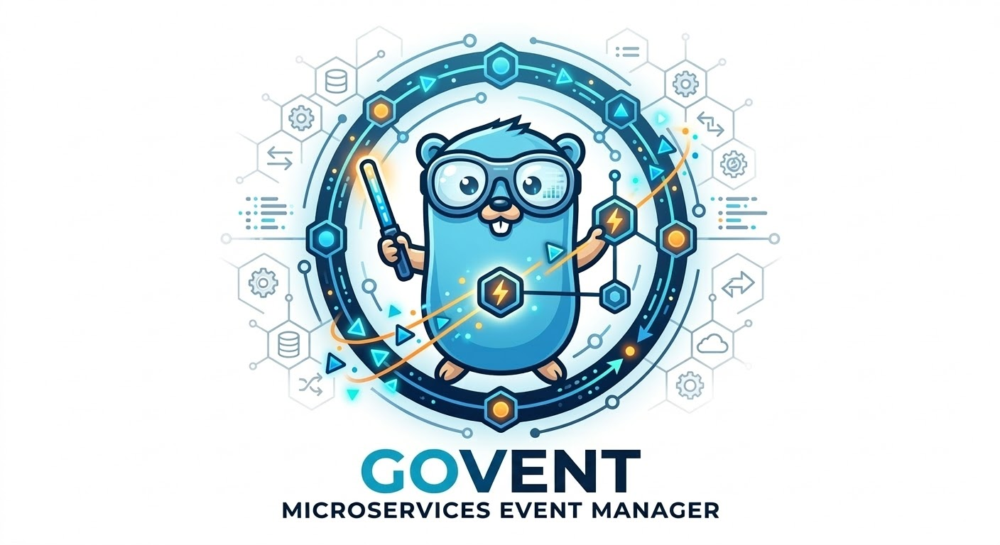

<!-- PROJECT LOGO -->
<br />
<p align="center">
  <a href="https://github.com/jarlex/govent">
    
  </a>
  <h3 align="center">Go-Vent</h3>
</p>


<!-- TABLE OF CONTENTS -->
## Table of Contents

* [About the Project](#about-the-project)
  * [Features](#features)
  * [Architecture](#architecture)
  * [Built With](#built-with)
* [Getting Started](#getting-started)
  * [Prerequisites](#prerequisites)
  * [Installation](#installation)
* [Usage](#usage)
  * [Configuration](#configuration)
  * [Running the Server](#running-the-server)
  * [Sending Events](#sending-events)
* [API Endpoints](#api-endpoints)
* [Roadmap](#roadmap)
* [Contributing](#contributing)
* [License](#license)


<!-- ABOUT THE PROJECT -->
## About The Project

Go-Vent is a synchronous event distribution system for microservices. It receives events via HTTP and routes them to configured actions (REST or gRPC) based on trigger rules defined in YAML configuration files.

### Features

- **Event Ingestion**: Receive events via HTTP POST
- **Trigger Matching**: Match events by type, source, or custom matchers
- **Multiple Action Types**: Execute REST calls or gRPC requests
- **YAML Configuration**: Define triggers and actions in simple YAML files
- **Health Check**: Built-in health endpoint for monitoring
- **Async Execution**: Actions are executed asynchronously for better performance

### Architecture

```
┌─────────────┐     ┌──────────────┐     ┌─────────────────┐
│   Client    │────▶│  HTTP Server │────▶│ Trigger Engine  │
└─────────────┘     └──────────────┘     └────────┬────────┘
                                                   │
                              ┌────────────────────┼────────────────────┐
                              ▼                    ▼                    ▼
                       ┌─────────────┐     ┌─────────────┐     ┌─────────────┐
                       │ REST Action │     │  gRPC Act.  │     │    ...      │
                       └─────────────┘     └─────────────┘     └─────────────┘
```

### Built With

- [Go](https://golang.org/) 1.21+
- [gopkg.in/yaml.v3](https://gopkg.in/yaml.v3) - YAML parsing
- [google.golang.org/grpc](https://google.golang.org/grpc) - gRPC support
- [google.golang.org/protobuf](https://google.golang.org/protobuf) - Protocol Buffers

<!-- GETTING STARTED -->
## Getting Started

### Prerequisites

- Go 1.21 or higher
- (Optional) Docker for containerized deployment

### Installation

```bash
# Clone the repository
git clone https://github.com/jarlex/govent.git
cd govent

# Download dependencies
go mod download

# Build the application
go build -o govent ./cmd/govent

# Run tests
go test ./...
```

### Docker (Optional)

```bash
docker build -t govent .
docker run -p 8080:8080 -v $(pwd)/configs:/app/configs govent
```


<!-- USAGE -->
## Usage

### Configuration

Create a `configs/triggers.yaml` file to define your triggers and actions:

```yaml
triggers:
  - name: notify-order-created
    eventType: order.created
    source: orders-service
    matchers:
      - type: eventType
      - type: source
    actions:
      - type: rest
        config:
          url: https://api.example.com/webhooks/orders
          method: POST
          headers:
            Content-Type: application/json
            Authorization: Bearer token123
          timeout: 30s
      - type: grpc
        config:
          address: notification-service:50051
          service: NotificationService
          method: SendNotification
          timeout: 10s
```

### Running the Server

```bash
# Run with default config path
./govent

# Or specify a custom config path
CONFIG_PATH=/path/to/triggers.yaml ./govent
```

The server will start on port 8080 by default.

### Sending Events

```bash
# Create an event
curl -X POST http://localhost:8080/events \
  -H "Content-Type: application/json" \
  -d '{
    "id": "evt-001",
    "type": "order.created",
    "source": "orders-service",
    "payload": {
      "orderId": "12345",
      "customer": "John Doe"
    },
    "metadata": {
      "version": "1.0"
    }
  }'

# Check health
curl http://localhost:8080/health
```


<!-- API ENDPOINTS -->
## API Endpoints

| Method | Endpoint | Description |
|--------|----------|-------------|
| POST | `/events` | Submit a new event |
| GET | `/health` | Health check endpoint |
| GET | `/*` | 404 for unknown routes |

### Event Schema

```json
{
  "id": "string (optional, auto-generated if missing)",
  "type": "string (required)",
  "source": "string (optional)",
  "payload": "object (optional)",
  "metadata": "object (optional)",
  "timestamp": "RFC3339 string (optional, auto-generated if missing)"
}
```


<!-- ROADMAP -->
## Roadmap

### High Priority

- [ ] **Retry with Exponential Backoff** - Retry failed actions up to 3 times with exponential backoff
- [ ] **Hot Reload** - Reload trigger configuration without restarting the server (SIGHUP or /reload endpoint)
- [ ] **Dead Letter Queue (DLQ)** - Store failed events after all retries for manual review
- [ ] **Event Transformation** - Transform payload before sending to actions (map, filter, template)

### Medium Priority

- [ ] **Authentication** - API keys or JWT to protect endpoints
- [ ] **Metrics** - Prometheus `/metrics` endpoint for monitoring
- [ ] **Advanced Trigger Conditions** - Regex, numeric comparators, cron-like scheduling
- [ ] **gRPC Server** - Receive events via gRPC in addition to HTTP

### Future Ideas

- [ ] **Message Queue Integration** - RabbitMQ/Kafka for async processing at scale
- [ ] **Database Persistence** - SQLite/PostgreSQL for config and event storage
- [ ] **Event Filtering** - Advanced filtering before trigger execution
- [ ] **Web UI** - Dashboard for trigger management and event monitoring


<!-- CONTRIBUTING -->
## Contributing

Contributions are what make the open source community such an amazing place to learn, inspire, and create. Any contributions you make are **greatly appreciated**.

1. Fork the Project
2. Create your Feature Branch (`git checkout -b feature/AmazingFeature`)
3. Commit your Changes (`git commit -m 'Add some AmazingFeature'`)
4. Push to the Branch (`git push origin feature/AmazingFeature`)
5. Open a Pull Request


<!-- LICENSE -->
## License

Distributed under the MIT License. See `LICENSE` for more information.
